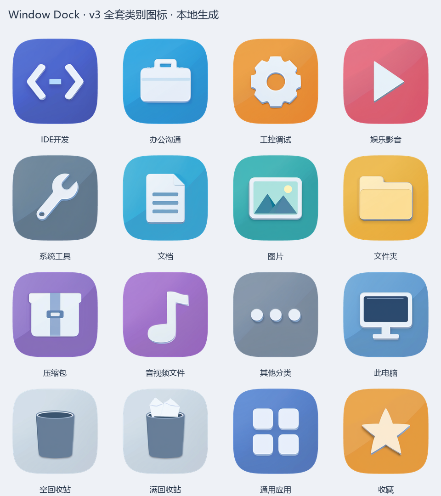

# Window Dock

**一个兼顾外观、桌面整理和低资源占用的 Windows Dock。**

在 [WKaleXD/iOS-style-Dock](https://github.com/WKaleXD/iOS-style-Dock) 的玻璃 Dock 基础上继续开发：把应用和文件放进可定制的分类入口，保留原文件位置，让桌面更清爽。


*当前代码渲染的外观预览，展示自定义应用分类与系统入口。首次启动的预设分类见下文，玻璃背景随实际桌面变化。*

[使用方法](#使用方法) · [从源码运行](#从源码运行) · [构建可执行程序](#构建可执行程序) · [兼容性与限制](#兼容性与限制)

## 能做什么

| 功能 | 当前实现 |
| --- | --- |
| 玻璃 Dock | 深浅主题、局部鱼眼放大、点击反馈；停靠上、下、左、右四边 |
| 分类入口 | 点击展开分类，大图标或单列列表；列表只显示小图标与名称 |
| 自动整理 | 读取用户桌面和公共桌面的顶层项目，按规则虚拟分类 |
| 自定义分类 | 名称、图标、规则、优先级均可修改；支持手动拖入 |
| 明确的归属 | 多个规则命中时只进入优先级最高的分类；手动归属优先 |
| 原生桌面收纳 | 收起已分类图标，保留 Windows 原生桌面交互；可切回显示全部 |
| 独立启动入口 | 常用应用可单独固定，分隔符可划分 Dock 的玻璃区域 |
| 系统入口 | 此电脑、空／满状态回收站；打开系统窗口、拖入回收及系统确认清空 |
| 持久化 | 保存分类、规则、手动归属、视图、排序与外观设置 |

**分类操作不会复制、移动、改名或删除原文件。** 主动把文件拖到回收站属于真实回收操作，与自动分类分开处理。

当前代码版本为 **1.1.26**。仓库提供源码和构建方式，不要求运行 AI 模型或图标生成服务。

## 从源码运行

当前验证环境为 **Windows 11 x64、Python 3.14 x64、PyQt5 5.15.11**。原生桌面组件需要 **Visual Studio 2022 Build Tools**，安装“使用 C++ 的桌面开发”，包含 MSVC x64 工具和 Windows SDK。

在 PowerShell 中执行：

```powershell
git clone https://github.com/GxZzzzz/Window-Dock.git
cd Window-Dock

py -3.14 -m venv .venv
.\.venv\Scripts\python.exe -m pip install -r requirements.txt

powershell -NoProfile -ExecutionPolicy Bypass -File .\native_desktop\build.ps1
.\.venv\Scripts\python.exe dock.py
```

没有 Python 启动器 `py` 时，使用已安装的 64 位 Python 的完整路径创建虚拟环境。命令只为本次构建进程设置 PowerShell 执行策略。

原生组件编译后位于 `native_desktop/WindowDockDesktop.dll`。缺少组件时，Dock 的分类界面仍可运行，但原生桌面收纳与拖入回收站不可用；完整体验需要先构建组件。

依赖准备好后，也可双击 **`启动 Window Dock.cmd`**：优先运行 `dist/WindowDock/WindowDock.exe`，没有打包版本时运行本项目虚拟环境中的源码。

根目录保留四个便捷入口：`1-启动.bat`、`2-关闭.bat`、`3-修复依赖.bat`、`4-调试启动.bat`。调试入口始终运行源码，适合查看错误输出。

## 使用方法

### 分类与整理

首次启动提供 **应用、文档、图片、文件夹、压缩包、影音** 六个可编辑分类。IDE 开发、办公沟通等图标已内置，可自行建立对应分类；软件不会把某台电脑的应用清单当作所有用户的预设。

- 单击 Dock 分类打开面板，双击面板项目打开应用或原文件。
- 把应用或文件拖到分类图标或分类面板，指定手动归属。
- 在 Dock 或托盘右键菜单选择“一键整理桌面”或“管理分类与分隔符”。
- 在管理窗口拖动分类调整优先级；添加分隔符划分显示区域。
- 面板右键 →“查看”→“大图标 / 列表”，各分类分别记住显示方式。
- 点击面板外或按 Esc 收起；面板内部保持简洁。
- 文件和图片保留扩展名；应用与快捷方式隐藏扩展名，悬停可查看完整名称和路径。

启用独立图标拖动排序时，可按住 Shift 将独立入口拖入分类；拖到 Dock 空白位置可固定独立入口。

### 规则怎样工作

规则编辑器提供文件类型、扩展名、名称包含、路径包含、指定文件或应用等条件，选择“满足任意条件”或“满足全部条件”，无需编写表达式。

例如创建一个 **IDE 开发** 分类：

1. 选择“满足全部条件”。
2. 添加“文件类型 → 应用与快捷方式”。
3. 添加“名称包含 → Visual Studio, Rider, PyCharm”。
4. 把该分类放在通用“应用”分类之前。

同一条件里的多个值用逗号分隔，任意一个匹配即可。名称匹配也会参考可解析的快捷方式目标。空规则分类只接收手动项目。

归属顺序为：

```手动指定 → 按分类顺序匹配第一项 → 保留为未归类项目```

项目右键“恢复自动分类”会取消手动指定；“从分类中移除”保留原文件，并停止把该项目自动收进分类。管理窗口可选择在保存时恢复已移除入口。

### 桌面显示与回收站

Dock 或托盘右键 →“桌面图标”：

| 模式 | 行为 |
| --- | --- |
| 仅显示未归类项目 | 收起已归类项目和原生回收站，由 Dock 提供入口 |
| 显示全部图标 | 恢复完整 Windows 桌面，Dock 分类继续可用 |
| 隐藏全部图标 | 使用 Windows 的桌面图标总开关 |

正常退出 Dock 会恢复收纳的桌面项目。原生组件在 Explorer 现有视图中工作，不绘制另一套桌面图标、文字或右键菜单。

点击 Dock 回收站打开 Windows 回收站，可在系统窗口恢复项目。拖入文件会将原项目送入系统回收站；拖入快捷方式不会删除它指向的文件。清空回收站保留 Windows 确认窗口。

**从分类面板拖到桌面出现“文件已存在”提示，是因为原文件本来就在桌面，并不表示 Dock 复制了一份。** 要重新显示桌面图标，使用“从分类中移除”或“显示全部图标”。

## 低资源设计

- 共用一个桌面索引，只枚举顶层目录，不递归扫描整块磁盘。
- 使用目录变化通知，300 ms 合并连续事件，后台更新受影响目录并复用未变化条目。
- 监听正常时不做周期性分类扫描；监听失败时以 60 秒间隔补偿检查并提示。
- 文件扫描、图标读取和回收操作在后台执行；图标按需读取并缓存。
- 动画结束后停止动画计时器，面板关闭后不持续绘制不可见内容。
- 默认“智能省电”玻璃背景由显示、鼠标进入及设置变化触发刷新。
- 回收站使用 Shell 通知，短时间事件合并，不做持续轮询。
- 成套图标是约 2 MiB 的静态 PNG，运行时没有模型、推理服务或实时材质渲染。

可见 Dock 仍有每 2.5 秒的位置、主题与层级检查；开启应用运行标记时可能查询进程。非智能背景刷新频率取决于设置。**低占用是设计目标，不是固定 CPU 百分比承诺。**

已有本机短时空闲与文件事件验证；这些结果不能代表所有机器、桌面规模或图形驱动下的表现。

## 配置、隐私与退出

配置：`%APPDATA%\BigFishDock\config.json`

日志：`%APPDATA%\BigFishDock\dock.log`

沿用原项目配置目录，便于保留旧设置。修改前请退出 Dock 并自行备份配置。

程序自身没有账号、遥测或云同步。分类读取本地桌面目录、用户手动添加的入口及快捷方式信息；玻璃效果使用本地内存中的背景截图。打开网页快捷方式或应用时，由目标程序处理其网络行为。

配置包含真实文件路径，日志可能包含路径与错误信息。反馈问题时请先移除个人路径和敏感内容。公开仓库不含个人配置、应用清单、诊断记录、模型和本地生成缓存。

退出使用托盘菜单或 `2-关闭.bat`。卸载时先关闭“开机自动启动”、正常退出，再移除程序目录；配置目录是否保留由用户决定。

## 构建可执行程序

在项目根目录执行。建议使用纯英文路径的构建虚拟环境，避免部分 Qt / PyInstaller 环境对中文环境路径的探测问题；源码目录和最终程序路径可包含中文。

```powershell
py -3.14 -m venv D:\WindowDockBuild\venv
& D:\WindowDockBuild\venv\Scripts\python.exe -m pip install -r requirements-build.txt

powershell -NoProfile -ExecutionPolicy Bypass -File .\native_desktop\build.ps1
& D:\WindowDockBuild\venv\Scripts\python.exe -m PyInstaller --noconfirm --clean WindowDock.spec
```

产物为 `dist/WindowDock/WindowDock.exe`。分发时需保留整个 **`WindowDock` 文件夹**，包括 `_internal`；只复制 EXE 无法运行。

构建会包含原生 DLL、正式图标和许可说明。第三方依赖拥有各自许可证，参见 [THIRD_PARTY_NOTICES.md](THIRD_PARTY_NOTICES.md)。

## 项目结构

```text
dock.py                      Dock 绘制、动画、托盘与程序入口
organizer.py                 分类规则与文件身份处理
organizer_service.py         共享索引、监听、事件合并、后台任务
organizer_ui.py              分类面板、列表、规则编辑和拖放
organizer_artwork.py          分类图标入口与回退绘制
menu_ui.py                   统一主题菜单
icon_theme.py                静态图标加载与缓存
desktop_manager.py           原生桌面组件生命周期与通信
desktop_visibility.py        Windows 桌面显示辅助
native_desktop_host.py        独立的原生连接进程
native_desktop/              C++ Explorer 接入、回收接口与构建脚本
recycle_bin.py                回收站通知与后台操作
trash_artwork.py              系统入口图标与回退绘制
assets/icons/ios-category-v2/ 正式图标包（manifest 版本为 v3）
docs/                        图标说明与上游截图存档
WindowDock.spec              PyInstaller 构建配置
```

旧桌面替代方案、设计候选、模型和开发缓存留在本地，不参与公开构建。当前启动入口使用 `native_desktop_host.py`，不依赖旧的 `desktop_host.py`。

## 成套图标

分类入口与系统入口统一使用微立体圆角图标；分类里的软件仍显示各自原图标。

<details>
<summary>查看 16 张正式图标</summary>



</details>

资源接口、尺寸和替换方式见 [图标说明](docs/ICONS.md)。

## 兼容性与限制

- 原生收纳目前只在 Windows 11 x64 验证；Windows 10、ARM64、32 位系统未验证。
- 原生接入依赖微软已标记不再推荐使用的 [IShellFolderView](https://learn.microsoft.com/en-us/windows/win32/api/shlobj_core/nn-shlobj_core-ishellfolderview) 接口。某些 Windows 版本可能不提供它，失败时保留完整原生桌面并提示。
- 当前 Dock 按主屏幕可用区域定位；多显示器、运行中切换 DPI、第三方桌面管理器共存尚未完整验证。
- Explorer 重启有有限重连机制，但完整 Explorer 重启流程仍需更多实机验证。
- 网络盘和可移动盘的回收行为未全面验证；程序不以永久删除作为回收失败的替代。
- 新增分类界面以简体中文为主，上游 Dock 部分设置保留中英切换。
- 没有全盘搜索、提醒、云同步、子分类或自动搬移文件。

## 来源与许可

本项目基于 **[WKaleXD/iOS-style-Dock](https://github.com/WKaleXD/iOS-style-Dock)** 开发，原项目署名 **WWQ**。保留其玻璃绘制、Dock 基础和 Git 历史，在此基础上加入虚拟分类、原生桌面接入及交互改进。上游截图保存在 [docs/upstream](docs/upstream)。

项目源码沿用 [MIT License](LICENSE)，保留原版权声明。第三方依赖的许可独立适用，详见 [第三方说明](THIRD_PARTY_NOTICES.md)。图标为本项目 AI 辅助制作的静态资源，非 Apple 官方素材。

## English

Window Dock is a Windows glass dock with virtual desktop organization, editable categories, manual assignment, grid/list views, four-edge placement, and native Explorer desktop integration. Files stay in place when categorized. Based on [WKaleXD/iOS-style-Dock](https://github.com/WKaleXD/iOS-style-Dock). Currently validated on Windows 11 x64; see the compatibility notes before building.
