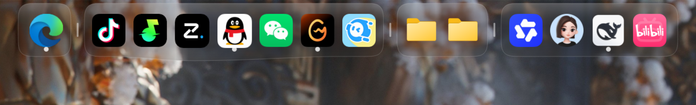

# 大肥鱼dock栏 · BigFish Dock

一个 Windows 桌面美化小工具：把 macOS / Nexus 那种 **Dock 图标栏**放到 Windows 桌面上。
纯 Python + PyQt5 手写，**毛玻璃是自己实现的**（没有用系统自带的亚克力接口），
所以四个角天生透明、不会有方形轮廓。支持 Windows 10 / 11。



---

## ✨ 功能

| 功能 | 说明 |
|---|---|
| **苹果风 Dock** | 鼠标滑过时图标鱼眼放大，玻璃条跟着拉伸并向上（贴屏幕顶部时向下）鼓起，凸起程度低/中/高三档可调 |
| **真毛玻璃** | 抓取 Dock 背后真实画面 → 缩小再放大做大半径模糊 → 画进玻璃形状里；模糊程度低/中/高/自定义四档 |
| **分隔符** | 在图标之间插一根细竖条分组；开启「隔断背景」后，分隔符处的玻璃会断开，两边各自收圆角 |
| **四种外观** | 跟随系统 / 浅色 / 深色 / 光感（带光照的玻璃：顶部亮边 + 斜向光带 + 跟随鼠标的柔光） |
| **三种位置** | 屏幕底部 / 屏幕顶部 / 自定义（填距底部像素数，Dock 始终水平居中；贴顶部时整体镜像，不会被屏幕边缘切掉） |
| **中英双语** | 托盘里一键切换，菜单和所有提示文字都会跟着变 |
| **托盘管理** | 添加/移除图标**只能通过右下角托盘**完成，平时不会误拖误删 |
| **拖动排序** | 可选（默认关闭） |
| **运行指示** | 正在运行的程序在图标下方显示一个小圆点（层级低于图标，放大时会被图标盖住） |
| **图标清晰** | exe 用 PrivateExtractIconsW 抠 256 像素图标；文件夹 / URL / 商店应用用外壳的「超大图标」列表取 256 像素 |
| **开机自启** | 写入注册表 HKCU\...\Run，随时可关 |
| **性能** | 静止时几乎不占 CPU（毛玻璃可设为「停止抓取」）；鼠标滑动时约 2 毫秒/帧 |

---

## ⬇️ 下载直接用（不需要装 Python）

1. 下载 **大肥鱼dock栏.exe**（约 36 MB，免安装单文件）
2. 双击运行。Windows 可能弹出蓝色 SmartScreen 提示 →
   点「**更多信息**」→「**仍要运行**」（个人开发的小工具，没有买代码签名证书）
3. 运行后看**屏幕右下角托盘**，找到大肥鱼图标，**右键**它：

```
显示 / 隐藏 Dock
添加图标…              ← 在这里固定你要的程序
添加分隔符
...
开机自动启动
语言 / Language
退出
```

> 想固定什么程序，就在「添加图标…」的窗口里挑（窗口会自动定位到「开始菜单 → 所有程序」）。

---

## 🔧 从源码运行

需要 Python 3.8+ 和 PyQt5：

```bash
pip install PyQt5
python dock.py
```

打包成独立的 exe：

```bash
pip install pyinstaller
pyinstaller --noconfirm --onefile --windowed --name BigFishDock ^
  --icon dock.ico --version-file version_info.txt dock.py
```

仓库里的 1-启动.bat / 2-关闭.bat / 3-修复依赖.bat / 4-调试启动.bat
是给不熟悉命令行的朋友准备的（双击即可）。

---

## ⚙️ 配置与数据

配置文件在 **%APPDATA%\BigFishDock\config.json**，日志在同一个目录的 dock.log。
删掉整个 %APPDATA%\BigFishDock 文件夹就会恢复默认设置。

彻底卸载：
1. 托盘右键 → 取消「开机自动启动」→ 退出
2. 删掉程序文件夹
3. 删掉 %APPDATA%\BigFishDock

---

## 🔒 隐私

- **完全离线**：程序不联网、不发送任何数据、没有遥测
- 只在你自己的电脑上读写两类文件：程序目录（图标等资源）和 %APPDATA%\BigFishDock\
- 抓屏只用于**本地**生成毛玻璃效果：抓图前会把本窗口临时标记为「不参与屏幕捕获」
  (WDA_EXCLUDEFROMCAPTURE)，抓完立刻恢复；截图里不会有 Dock 自己
- 抓到的画面**不落盘**，只存在内存里，退出即消失

---

## ❓ 常见问题

**Q：启动时报 `Failed to load Python DLL ... _MEIxxxx\python312.dll`？**
这是 PyInstaller 单文件打包的已知问题：%TEMP% 下残留了不完整的 _MEI 目录，
而环境变量里又带着 _PYI_APPLICATION_HOME_DIR 指向它。
解决办法：删掉 %TEMP%\_MEI* 残留目录后重新运行，或者重启一次电脑。

**Q：毛玻璃没效果 / 一片死黑？**
部分显卡驱动不支持屏幕捕获排除，程序会自动降级为普通半透明，不影响使用。

**Q：Dock 挡住了窗口？**
托盘 →「窗口层级」选「置底」，它就会贴在桌面这一层，任何窗口都在它上面。

**Q：怎么让 Dock 出现在屏幕上更高的位置？**
托盘 →「窗口位置」→「自定义…」，填「距屏幕底部多少像素」。

---

## 📄 许可

MIT License，见 [LICENSE](LICENSE)。

---

## English (short)

**BigFish Dock** is a lightweight macOS-style dock for Windows, written in Python + PyQt5
with a **hand-made frosted-glass** effect (screen capture + blur, no OS acrylic API).
Features: fisheye magnification with a stretching glass bar (three bulge strengths),
separators that can split the glass background, four themes (system / light / dark / glossy),
three screen positions with a fully mirrored top mode, bilingual UI, tray-only icon
management, running-app dots, autostart, and low CPU usage (~2 ms/frame while animating).
Icons are extracted at up to 256 px, including folder and URL shortcuts.

Download 大肥鱼dock栏.exe and double-click - no Python needed.
Configuration lives in %APPDATA%\BigFishDock. The app is fully offline and collects nothing.